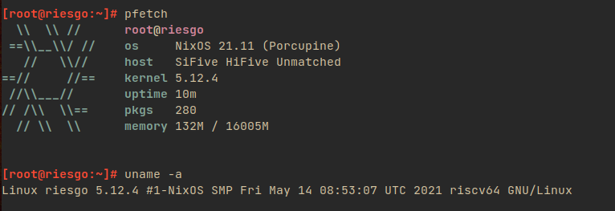

# NixOS on RISC-V

This repo contains board-specific packages to get NixOS running on RISC-V platforms.
I'm using [this Nixpkgs tree](https://github.com/zhaofengli/nixpkgs/tree/riscv).

For the HiFive Unmatched, include `nixos/unmatched.nix` in your NixOS configuration.

## Is it booting?

Yes! More details [here](https://github.com/NixOS/nixpkgs/issues/101651#issuecomment-852725823).



## Binary cache

A binary cache is available [here](https://app.cachix.org/cache/unmatched), with all packages in `binary-cache/world.nix` cached.
Note that all binaries here are built against [my riscv-cached branch](https://github.com/zhaofengli/nixpkgs/tree/riscv-cached).

Use the following configurations:
```
substituters = https://cache.nixos.org https://unmatched.cachix.org
trusted-public-keys = cache.nixos.org-1:6NCHdD59X431o0gWypbMrAURkbJ16ZPMQFGspcDShjY= unmatched.cachix.org-1:F8TWIP/hA2808FDABsayBCFjrmrz296+5CQaysosTTc=
```

## HiFive Unmatched

### Installing U-Boot to the SPI Flash

It's recommended to install U-Boot to the on-board SPI flash using the installer image.
You can obtain a pre-built installer image (`unmatched-spi-installer.img`) [here](https://github.com/zhaofengli/nixos-riscv64/releases), or build `riscv64.uboot-unmatched-spi-installer`.
Burn the image into an SD card and insert it into the HiFive Unmatched.
Ensure that the MSEL DIP switch has the factory default setting (MSEL[3:0] = 1011) to load U-Boot from the SD card.

<details>
<summary>MSEL Factory Defaults (MSEL[3:0] = 1011)</summary>

```
(Edge Of Board)

--------------- ON
|  | o | o o  |
|  o | o | |  |
--------------- OFF

BOOT MODE SEL
```
</details>

If successful, you should see the following in the serial console:

```
mmc0 is current device
Scanning mmc 0:3...
Found U-Boot script /boot.scr
2329 bytes read in 4 ms (568.4 KiB/s)
## Executing script at 88100000


Firmware installer


Installing U-Boot to the SPI flash in 10 seconds!
devtype = mmc
devnum = 0
bootpart = 3

:: Starting flash operation

-> Initializing SPI Flash subsystem...
SF: Detected is25wp256 with page size 256 Bytes, erase size 4 KiB, total 32 MiB

-> Reading new firmware from storage...
6291456 bytes read in 5419 ms (1.1 MiB/s)

-> Writing new firmware to SPI...
device 0 offset 0x0, size 0x600000
12288 bytes written, 6279168 bytes skipped in 15.45s, speed 449389 B/s

✅ Flashing seems to have been successful!
You can now set MSEL[3:0] = 0110

Resetting in 5 seconds
resetting ...
System reset not supported on this platform
### ERROR ### Please RESET the board ###
```

Now, configure the MSEL DIP switch like the following (MSEL[3:0]=0110):

```
(Edge Of Board)

--------------- ON
|  | | o o |  |
|  o o | | o  |
--------------- OFF

BOOT MODE SEL
```

If all goes well, you should be able to get into U-Boot without an SD card after powering your board back on.

<details>
<summary>Alternative: Manual installation from another Linux distro</summary>

Build `pkgs.riscv64.uboot-unmatched-spi-image`.
Then, flash it onto the on-board SPI flash with:

```
modprobe mtdblock
dd if=spi-image.img of=/dev/mtdblock0 bs=4096 conv=sync
```
</details>

<details>
<summary>Alternative: Installing U-Boot onto the SD card</summary>

**Note: With this method, you have to set up NixOS manually and can't use the pre-built SD image.**

Build `pkgs.riscv64.uboot-unmatched`.

You need to create two GPT partitions on the SD card with the following sizes and GUIDs:

- 1MiB `5b193300-fc78-40cd-8002-e86c45580b47` (HiFive Unleashed FSBL)
- 4MiB `2e54b353-1271-4842-806f-e436d6af6985` (HiFive Unleashed BBL)

The easiest way to do this is with this command (you need `pkgs.gptfdisk`):

```
sgdisk -g --clear --set-alignment=1 \
    --new=1:34:+1M: --typecode=1:5b193300-fc78-40cd-8002-e86c45580b47 \
    --new=2:2082:+4M: --typecode=2:2e54b353-1271-4842-806f-e436d6af6985 \
    [block device]
```

Write the bootloader to the SD card as follows:

```
# FSBL
dd if=result/u-boot-spl.bin of=/dev/mmcblk0p1 bs=4k oflag=direct

# SBL
dd if=result/u-boot.itb of=/dev/mmcblk0p2 bs=4k oflag=direct
```

Configure MSEL like the following (MSEL[3:0]=1011, default configuration):

```
(Edge Of Board)

--------------- ON
|  | o | o o  |
|  o | o | |  |
--------------- OFF

BOOT MODE SEL
```
</details>

### Installing NixOS onto the SD Card

**Note: To use the pre-built SD image, you must have installed U-Boot onto the on-board SPI flash.**

You can obtain a pre-built SD image (`nixos-sd-image-unmatched.zst`) [here](https://github.com/zhaofengli/nixos-riscv64/releases), or build `riscv64.sd-image-unmatched`.
Decompress the image, then burn it into an SD card.

The image has [the binary cache](https://app.cachix.org/cache/unmatched) preconfigured, and you can reconfigure the SD image by running `sudo nixos-rebuild switch`,
Alternatively, you can also install NixOS manually onto the NVMe drive using the SD image.
If you choose to go the manual route, include `nixos/unmatched.nix` from this repo in your configuration.

## StarFive VisionFive

Include `nixos/visionfive.nix` from this repo in your configuration.

## References

- https://github.com/carlosedp/riscv-bringup/tree/master/unmatched
- https://github.com/NixOS/nixpkgs/pull/115406

## See Also

There are other efforts to bring NixOS to RISC-V:

- https://github.com/NickCao/nixos-riscv
- https://github.com/ius/jh7100
